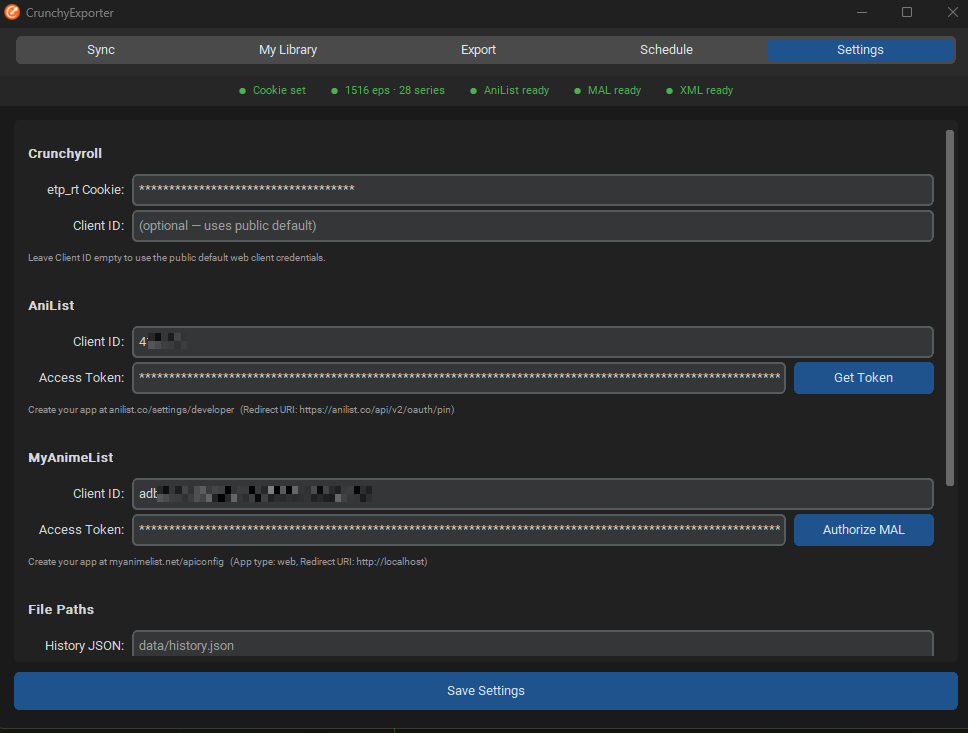
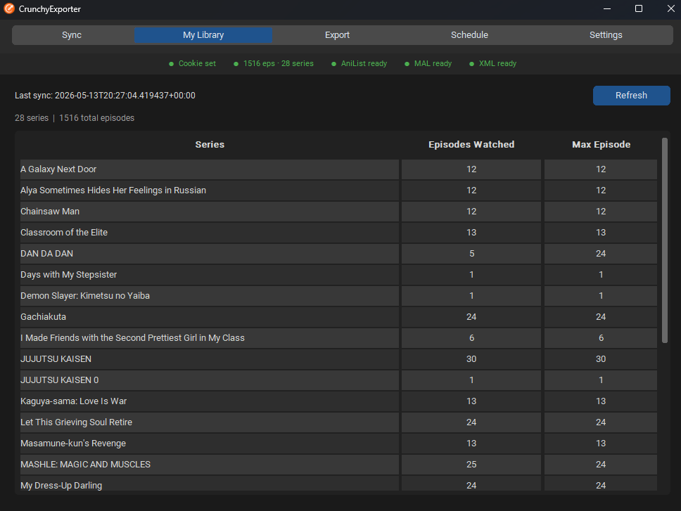
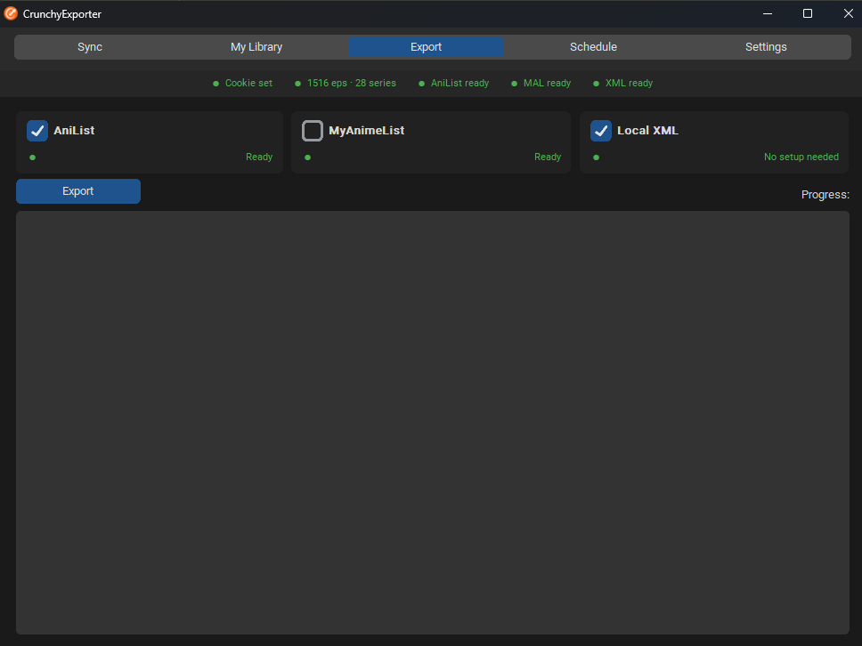
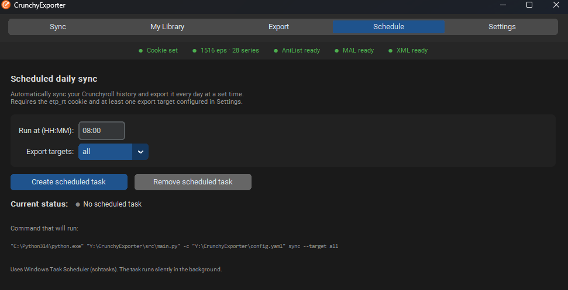
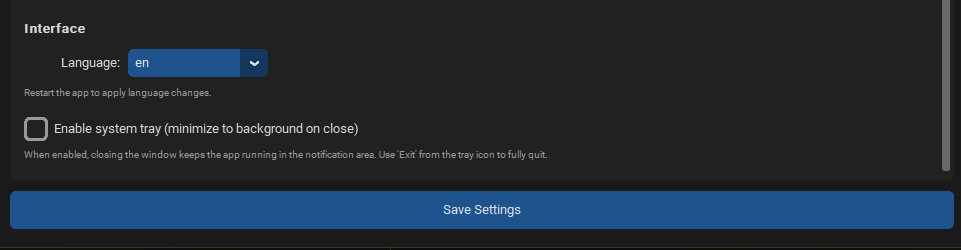

<p align="center">
  
</p>

<p align="center">
  <a href="LICENSE"></a>
  <a href="https://github.com/ruflas/CrunchyExporter/releases"></a>
  
  <a href="https://github.com/ruflas/CrunchyExporter/releases/latest"></a>
</p>

<p align="center">Fetches your Crunchyroll watch history and exports it to <b>AniList</b>, <b>MyAnimeList</b>, and a local <b>MAL-compatible XML</b> file.</p>

Exports include watch progress, series status (watching/completed), and real start/finish dates from your Crunchyroll history.

---

## Requirements

- Python 3.11+
- A Crunchyroll account (active browser session required for auth)

---

## Setup

```bash
pip install -r requirements.txt
python main.py
```

---

## Step 1 — Get your Crunchyroll session cookie

CrunchyExporter authenticates using the `etp_rt` session cookie from your browser. No password is stored or required.

1. Open [crunchyroll.com](https://www.crunchyroll.com) and log in
2. Press `F12` to open DevTools
3. Go to the **Application** tab (Chrome/Edge) or **Storage** tab (Firefox)
4. In the left panel expand **Cookies → https://www.crunchyroll.com**
5. Find the row named `etp_rt` and copy its **Value**

Open the app, go to the **Settings** tab and paste the value in the **etp_rt Cookie** field. Click **Save Settings**.



Then go to the **Sync** tab and click **Sync Now**.


On success the status bar at the top will show something like:
```
● Cookie set    ● 1513 eps · 28 series    ● AniList ○ MAL ● XML ready
```

History is saved to `data/history.json`. Re-running sync only adds new episodes — it never duplicates.

> **Note:** The `etp_rt` cookie expires when your browser session ends. If sync starts failing with a 401 error, get a fresh cookie from DevTools.

---

## Step 2 — View your history

Open the **My Library** tab to see all synced series with episode counts.



---

## Step 3 — Export

Open the **Export** tab. Each card shows whether a target is configured and ready.



Select the targets you want and click **Export**.
If a token is missing, the authorization flow starts automatically.

---

### Option A: Local XML (no account needed, fastest)

Check **Local XML** and click **Export**.

Generates `data/animelist.xml`. Import it at:
- MyAnimeList: [myanimelist.net/import.php](https://myanimelist.net/import.php)
- AniList: [anilist.co/settings/import](https://anilist.co/settings/import) — select MAL format
- Kitsu and most other tracking sites

> **Note:** The XML does not include MAL IDs (Crunchyroll doesn't provide them). MAL and AniList resolve entries by title on import.

---

### Option B: AniList

Syncs progress, status and real completion dates directly via the AniList API.

**1. Create an API client**
- Go to [anilist.co/settings/developer](https://anilist.co/settings/developer) and create a new client
- Set **Redirect URL** to exactly: `https://anilist.co/api/v2/oauth/pin`
- Copy the **Client ID**

**2. Enter it in Settings**

Open the **Settings** tab, paste the Client ID under **AniList**, then click **Get Token**.
Your browser will open — authorize the app and copy the `access_token` from the redirect URL back into the dialog.

Click **Save Settings**. The AniList card in the Export tab will turn green.

From now on the export runs without any browser interaction.

---

### Option C: MyAnimeList

Syncs progress, status, start date and finish date directly via the MAL API.

**1. Create an API client**
- Go to [myanimelist.net/apiconfig](https://myanimelist.net/apiconfig) and click **Create ID**
- **App Type**: `web` — required for OAuth
- **App Redirect URL**: `http://localhost`
- **Purpose of Use**: `hobbyist`
- Submit and note down the **Client ID**

**2. Enter it in Settings**

Open **Settings**, paste the Client ID under **MyAnimeList**, then click **Authorize MAL**.
Your browser will open — authorize the app. MAL redirects to `http://localhost/?code=XXXX` — the page won't load, that's expected. Copy the `code=` value from the address bar and paste it into the dialog.

Click **Save Settings**. The MAL card in the Export tab will turn green.

From now on the export runs without any browser interaction.

---

## Step 4 — Schedule automatic daily syncs (optional)

Open the **Schedule** tab, choose a time and export targets, then click **Create scheduled task**.



On **Windows** this creates a Windows Task Scheduler entry.
On **Linux/Mac** it adds an entry to your crontab.

The task runs `python src/main.py sync` silently in the background — no window required.
Requires `etp_rt` saved in `config.yaml` (set it via the Settings tab).

---

## System tray (optional)

Enable **System tray** in Settings → Interface. When active, closing the window keeps the app
running in the notification area. Right-click the tray icon to sync immediately or exit.



---

## Config reference

All settings can be edited directly in the **Settings** tab. The underlying `config.yaml` looks like this:

```yaml
locale: "en-US"           # Language for series titles from Crunchyroll

ui:
  language: "en"          # GUI language: en | es | any file in locales/
  tray_enabled: false     # true to minimize to system tray on close

storage:
  path: "data/history.json"

crunchyroll:
  etp_rt: ""              # Session cookie from browser (see Step 1)
  client_id: ""           # Leave blank to use built-in default
  client_secret: ""       # Leave blank (public client, no secret needed)

exporters:
  mal_xml:
    path: "data/animelist.xml"
  anilist:
    client_id: ""
    access_token: ""
  mal:
    client_id: ""
    access_token: ""
```

---

## Troubleshooting

**Sync fails with `Login failed (400): unsupported_grant_type`**
CR no longer supports email/password login via the API. Use the `etp_rt` cookie method described in Step 1.

**Sync fails with `Login failed (400): missing_required_field`**
The `etp_rt` value is missing or empty. Make sure you copied the full cookie value from DevTools.

**Sync fails with 401 after working before**
The `etp_rt` cookie expired. Log into Crunchyroll again and copy a fresh value from DevTools → Settings.

**`invalid_client` error on AniList**
The Client ID in Settings is wrong, or the redirect URL in your AniList app is not exactly `https://anilist.co/api/v2/oauth/pin`.

**MAL authorization page shows 400 Bad Request**
Your MAL app type is set to `other`. Change it to `web` in [myanimelist.net/apiconfig](https://myanimelist.net/apiconfig) — only `web` supports the authorization code flow.

**Some series not found on AniList or MAL**
Crunchyroll sometimes uses different titles. The exporter automatically retries with a normalized title as fallback. If a series still fails, add it manually on the tracking site.

---

## Adding a language

1. Copy `locales/en.json` → `locales/<lang_code>.json`
2. Translate the values (do not change the keys)
3. Set `ui.language: "<lang_code>"` in Settings and restart
4. Submit a pull request — contributions welcome

Current languages: **English** (`en`), **Spanish** (`es`)

---

## Project structure

```
CrunchyExporter/
├── src/                         # Bundled library (from CrunchyExporter-cli)
│   ├── crunchyroll/
│   │   ├── auth.py              # CR authentication (etp_rt_cookie grant)
│   │   ├── history.py           # Watch history fetcher (paginated)
│   │   └── models.py            # Data classes
│   ├── exporters/
│   │   ├── anilist.py           # AniList GraphQL exporter
│   │   ├── mal.py               # MyAnimeList REST exporter
│   │   └── mal_xml.py           # Local MAL XML exporter
│   ├── storage/
│   │   └── history_store.py     # JSON persistence
│   └── main.py                  # CLI entry point (used by Schedule/Tray)
├── gui/
│   ├── app.py                   # Main window
│   ├── i18n.py                  # Locale loader
│   ├── tray.py                  # System tray
│   ├── statusbar.py             # Status indicator bar
│   └── tabs/                    # One module per tab
├── locales/
│   ├── en.json
│   └── es.json
├── data/                        # Generated — gitignored
├── main.py                      # GUI entry point
└── config.example.yaml
```

---

## Contributing

Contributions are welcome.

```bash
git clone https://github.com/ruflas/CrunchyExporter.git
cd CrunchyExporter
pip install -r requirements.txt
cp config.example.yaml config.yaml   # Linux/Mac
Copy-Item config.example.yaml config.yaml  # Windows
python main.py
```

### Good areas to contribute

- **New languages** — copy `locales/en.json`, translate, submit PR
- **New exporters** — Kitsu, Anime-Planet, Shikimori (add to `src/exporters/`)
- **Better title matching** — fuzzy search or manual override mappings
- **Bug reports** — if a series fails to match or exports incorrectly, open an issue with the series title and the error

### Please avoid

- Modifying `src/` directly — it is a copy of [CrunchyExporter-cli](https://github.com/ruflas/CrunchyExporter-cli); fixes should go there first
- Breaking the existing Settings/Export flow without discussion
- Adding dependencies that aren't strictly necessary

---

## Related

- [CrunchyExporter-cli](https://github.com/ruflas/CrunchyExporter-cli) — CLI version / underlying library
